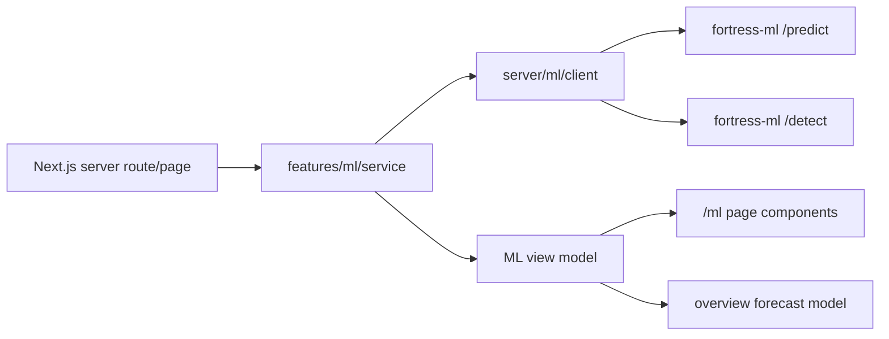
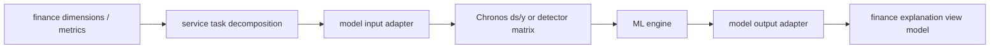

# ML Insights Dashboard Design

## Goal

Add a dedicated ML insights surface to the Next.js dashboard and move the overview month-end spending progress back to ML-first forecasting, matching the value of the earlier Streamlit dashboard while preserving the current Whooing dashboard architecture.

## Context

The current Next.js dashboard is backed by the local `whooing.*` mirror and uses server-rendered view models. Its overview forecast is a simple linear projection, and the `analysis` page intentionally presents rule-based insights. Separately, the running `fortress-ml` service exposes:

- `POST /predict` for monthly spending forecast using the existing ML engine.
- `POST /detect` for anomaly detection using the existing ML engine.

The new work should make that ML capability visible without reshaping the Whooing mirror schema or mixing ML logic directly into React components.

## Scope

In scope:

- Add a new `/ml` dashboard route and sidebar item.
- Add a dashboard-side ML client/service boundary.
- Use ML forecast data in the overview month-end forecast and spending chart when available.
- Keep the existing linear overview forecast as a fallback.
- Render a combined ML page: financial coach summary, forecast chart, anomaly list, and model status.
- Expose enough metadata to distinguish ML-backed output from fallback output.

Out of scope:

- Rebuilding or retraining the ML engine.
- Changing the `whooing.*` mirror schema.
- Replacing the existing rule-based `analysis` page.
- Persisting ML results to PostgreSQL.

## Architecture

The dashboard will add a small ML boundary under `dashboard/src/server/ml`. This boundary owns HTTP calls to `fortress-ml`, timeout behavior, response parsing, and fallback metadata. Feature code consumes normalized view models rather than raw ML API responses.

Overview becomes ML-first: it will request the forecast from the ML service, pass it into the existing overview view-model builder, and use it for the `월말 예상` summary and forecast band. If the ML service is unavailable or returns invalid data, overview keeps its current linear projection and labels the insight as fallback.

The new `/ml` page will use a dedicated feature folder under `dashboard/src/features/ml`. It will present the same ML forecast in more depth and pair it with anomaly detection results. The UI should feel like an operational dashboard, not a marketing page.

The service boundary must preserve a strict ML/domain split. Whatever dimension arrives, whatever metric arrives, and however many dimension/metric combinations arrive, the ML engine only sees model-shaped data such as Chronos `ds/y` time series or detector feature matrices. The dashboard/service layer interprets finance semantics, decomposes them into prediction or detection tasks, and converts model output back into finance-facing explanations.

## Data Flow

Future generalized ML tasks should follow the same shape:

## Forecast Contract

The dashboard-side normalized forecast will include:

- `source`: `ml` or `fallback`
- `asOf`: ISO date used for prediction
- `projectedFinal`: final month-end projected spending
- `series`: day-level values for actual/projected/AI/bounds
- `message`: short user-facing interpretation
- `safeDaily`: remaining daily budget against the configured monthly limit
- `status`: `stable`, `watch`, or `over`

The ML API may return arrays named `ai_pure`, `ai_upper`, `ai_lower`, `projected`, and `projected_index`. The dashboard service converts those into chart-friendly rows.

## Anomaly Contract

The dashboard-side anomaly model will include:

- `date`
- `description`
- `category`
- `amount`
- `score`
- `isAnomaly`

The `/ml` page should show high-score anomaly candidates first, while keeping non-anomalous scored rows available as context if the API returns them.

## UI Design

The `/ml` page uses the existing dashboard visual language:

- Header: "ML 인사이트" with a status badge showing `ML 연결` or `fallback`.
- Metric row: projected month-end spend, budget delta, anomaly count, daily safe spend.
- Main chart: actual spend, ML projected path, AI pure forecast, confidence band.
- Coach panel: short interpretation of the forecast and what it implies for the remaining days.
- Anomaly panel: list of unusual transactions with score, amount, date, and category.
- Model status panel: ML endpoint, prediction date, fallback state, and data caveat.

The existing `/analysis` page remains the rule-based analytical page. The new `/ml` page is the portfolio-grade model showcase and practical finance coach.

## Error Handling

The ML client should:

- Use a short timeout so server rendering does not hang.
- Return `null` or a typed unavailable state on fetch failure.
- Validate arrays before using them.
- Let overview and `/ml` fall back to deterministic projection.
- Surface the fallback state clearly in UI copy.

## Testing And Verification

Implementation should verify:

- `npm run lint`
- `npm run build`
- `/overview` renders with forecast content after the change.
- `/ml` renders when the ML service is available.
- `/ml` still renders a fallback state when the ML service is unavailable or invalid.

## Acceptance Criteria

- Sidebar contains `ML 인사이트`.
- `/ml` is reachable and renders a full ML page.
- Overview `월말 예상` and chart forecast prefer ML data over linear projection.
- Linear projection remains available as fallback.
- ML HTTP details are isolated under `dashboard/src/server/ml`.
- No `whooing.*` schema changes are made.
