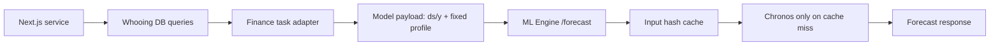

# ML Render Path Optimization Design

## Goal

Make the ML dashboard path cheap enough to render repeatedly without re-running avoidable database reads, model input shaping, or Chronos inference for the same finance state.

## Problem

The current Next.js dashboard calls the ML engine through legacy endpoints. Those endpoints read finance tables inside the ML process, shape the finance meaning there, and run model work on every request. That makes the Server Component render path sensitive to ML startup, duplicate requests, and repeated inference even though the ledger only has roughly one to two thousand rows.

## Boundary

The dashboard service layer owns finance semantics. It reads `whooing.*`, interprets fixed versus variable spending using `whooing.accounts.category`, and emits model-shaped tasks.

The ML engine owns model execution only. It accepts Chronos `ds/y` series or detector feature rows and does not need to know whether a dimension was a card, account, category, or dashboard widget.

## Target Flow

## Forecast Payload

The dashboard sends:

- `task_id`: stable finance task name.
- `today`: prediction date.
- `series`: daily variable spending points as `{ ds, y }`.
- `actual`: current-month daily total spending points for projection anchoring.
- `fixed_profile`: expected fixed spending by due day.
- `prediction_length`: days in the month.

## Performance Rules

- The ML engine computes a stable hash from the model payload.
- Identical payloads return from memory cache.
- Concurrent identical requests share one in-flight computation.
- Legacy `/predict` and `/detect` stay available, but the dashboard should use `/forecast` with service-built payloads.

## Acceptance Criteria

- ML Engine exposes a pure `/forecast` endpoint.
- Dashboard no longer asks the ML engine to read finance DB tables for forecast rendering.
- Repeated identical forecast requests return a cache hit.
- Overview and `/ml` still render fallback data when the ML engine is unavailable.
